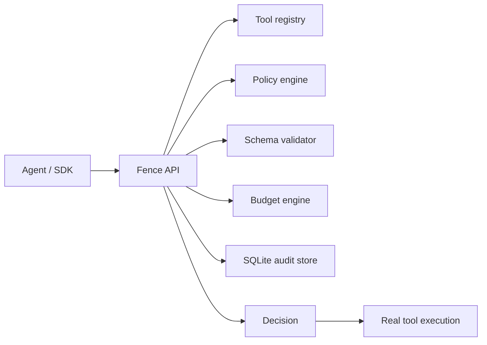

# Fence: What I Built, What I Learned, and Why It Matters

I built Fence because I kept running into the same problem with agentic systems:
the model can suggest an action very convincingly, but once it gets access to tools, the real question becomes whether that action should be allowed at all.

Fence is my answer to that boundary.

It sits between an agent and the tools it wants to use. Before a tool call reaches execution, Fence checks policy, validates the arguments, enforces budgets, and records what happened.

## Why I Built It

I wanted a project that was small enough to understand, but real enough to matter.

Agent safety is not just a prompt problem. It is a runtime problem.

If a model can:
- search internal knowledge
- update a ticket
- call a shell command
- touch a database
- access secrets

then the system around the model needs to decide what is safe, what is risky, and what should require approval.

Fence is built for that decision point.

## What Fence Does

Fence is a policy gateway for AI agent tool calls.

It checks:
- whether the tool is registered
- whether the agent is allowed to use it
- whether the arguments match the expected schema
- whether the action is high-risk
- whether human approval is required

The current implementation uses:
- FastAPI for the API layer
- Pydantic for validation
- SQLite for persistence
- YAML for policy config
- a small Python client for integration
- a support triage agent demo to show the flow end to end

## The Architecture

At a high level, Fence looks like this:

The important idea is that Fence does not invent safety out of thin air.

Safety comes from declared capabilities:
- which tools exist
- which tools each agent can use
- which arguments are valid
- which tools are high-risk
- which actions need approval

That became one of the most important lessons in the project.

## The Demo That Made It Real

I added a support triage agent because it is a believable workflow:
- read a ticket
- search a knowledge base
- draft a reply
- escalate if needed
- update the ticket

That demo helped me see the actual shape of the problem.

The agent can be useful, but every step still needs governance.

The demo also forced me to handle the practical problems that show up in real systems:
- model output is messy
- JSON is often close to right, but not quite
- a tool call can be semantically wrong even when the model sounds confident
- fallback paths matter
- the demo only works if it survives bad conditions

That is why the demo now includes:
- model-driven action selection
- argument repair
- policy checks
- a deliberately blocked high-risk action

It is still a demo, but it is a meaningful one.

## What I Learned About Safety

One of the biggest lessons was that safety is not a single blocklist.

The real model is more like this:
1. the tool must exist
2. the agent must be allowed to use it
3. the arguments must be valid
4. the risk level must be acceptable
5. some actions require human approval
6. some argument patterns should be blocked

That is a more honest way to think about agent safety than just saying:

> block bad tools

Because in real systems, "bad" is contextual.

For example:
- `search_kb` is fine for a support agent
- `execute_shell` is a high-risk capability
- `update_database` may be fine in one workflow and forbidden in another

Fence is built around that idea.

## What I Learned About Agents

Before this project, "agent" felt abstract.

Now it feels much more concrete:

- state
- a decision step
- a tool call
- a result
- another decision step

That is the loop.

The hard part is not the loop itself.
The hard part is everything around it:
- deciding what tools the agent should be allowed to call
- making sure the call shape is valid
- stopping the agent from wandering into risky behavior
- being able to explain what happened later

Fence lives exactly at that boundary.

## What I Learned About Building Infra

This project made me think like an infrastructure engineer instead of just a script writer.

I had to answer questions like:
- Where does policy live?
- What is the source of truth?
- What survives a restart?
- What should stay in memory vs. persist?
- How do I make tool calls visible and auditable?
- How do I make integration easy enough that someone else would actually use it?

That led to design choices like:
- SQLite for local persistence
- an adapter layer for different payload shapes
- a small client library
- docs that explain the learning path
- a runbook for repeatable setup

Those choices are not flashy, but they are the choices that make software usable.

## Why The Project Matters To Me

I think Fence is valuable because it shows the kind of engineering I like to do:

- turn a fuzzy idea into something real
- build a system that has a clear boundary
- think through safety and reliability, not just features
- write code that other people can integrate
- explain the system clearly afterward

It also gave me a project I can talk about in interviews with real technical depth:
- API design
- validation
- policy enforcement
- persistence
- demo workflows
- integration patterns
- runtime governance

## The Next Version

The current project is the foundation.

A production version would likely need:
- Postgres for durable source of truth
- Redis for hot state and rate limits
- tenant-scoped API keys
- policy versioning
- human approval workflow
- sandboxed execution for risky tools
- load testing
- adversarial tests
- stronger observability

That is the direction I would take if I wanted to turn Fence into a production control plane.

## Closing Thought

Fence started as a simple question:

what if there were a safety layer in front of agent tool calls?

It became a much more useful question:

how do we let agents act, without giving them unlimited power?

Fence does not answer that completely.

But it does show a practical way to start: declare tools, validate calls, enforce policy, and keep an audit trail before execution.
