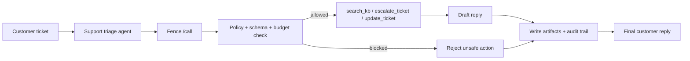

# Fence

Fence is a policy gateway for AI agent tool calls.

Put it between an agent and a tool, and Fence decides whether the call is allowed before anything runs.

It is useful when you want agents to:

- stay inside a policy
- use only approved tools
- pass validated arguments
- keep an audit trail
- require approval for risky actions

## How Teams Use It

Most teams will not run Fence as a chatbot. They wire it into the path an agent takes before it touches a real tool.

The flow is simple:

1. A model proposes a tool call.
2. Your app sends that call to Fence.
3. Fence checks policy, schema, budget, and risk.
4. Fence returns allow or block.
5. Your app runs the tool only if Fence approves it.

That makes Fence feel like policy-as-code for agent actions.

Example policy:

```yaml
policies:
  support-agent:
    allowed_tools:
      - search_kb
      - draft_reply
      - escalate_ticket
      - update_ticket
    blocked_operations:
      - execute_shell
    rate_limits:
      calls_per_minute: 60

tool_registry:
  execute_shell:
    risk_level: critical
    approval_required: true
```

## What It Includes

- FastAPI service for runtime decisions
- tool registry and policy enforcement
- Pydantic schema validation
- SQLite persistence for sessions and audit logs
- tiny Python client for integration
- support triage demo agent
- architecture diagrams and a runbook

## Demo

Fence’s best demo is the support triage agent.

It shows a real ticket being triaged, safe actions being approved, risky actions being blocked, and audit artifacts being written.



Fastest local run:

```bash
ollama pull llama3.2:1b
export OLLAMA_MODEL=llama3.2:1b
python examples/support_triage_agent.py
```

If you want to run the full local stack:

```bash
python3.11 -m venv .venv
source .venv/bin/activate
python -m pip install --upgrade pip setuptools wheel
pip install -r requirements.txt

export FENCE_API_KEYS="dev-key"
export ENABLE_TELEMETRY=false
python proxy.py
```

In another terminal:

```bash
source .venv/bin/activate
ollama serve
ollama pull llama3.2:1b
export OLLAMA_MODEL=llama3.2:1b
python examples/support_triage_agent.py
```

## Integrate Fence

The easiest integration pattern is:

```python
from fence_client import FenceClient

fence = FenceClient(base_url="http://127.0.0.1:8000", api_key="dev-key")
decision = fence.decide_tool_call(
    agent_id="support-agent",
    tool_name="update_ticket",
    arguments={
        "ticket_id": "TK-1042",
        "fields": {"priority": "urgent"},
    },
)

if decision.success:
    # run the real tool
    pass
```

If your framework already emits provider-shaped payloads, Fence can normalize those too.

Useful endpoints:

- `GET /health`
- `GET /tools`
- `POST /call`
- `POST /v1/decide`

## Current Status

Fence is a real working prototype, not a finished enterprise platform.

It is good for:

- learning how agent governance works
- putting a policy layer in front of tools
- showing safety checks, validation, and audit logging

It is not yet a full production control plane with multi-tenant auth, Redis, Postgres, sandboxed execution, and policy rollout.

## Repository Layout

```text
proxy.py                  # API server
fence_client.py           # tiny client for integration
safety_guardrails.py      # policy engine
semantic_validator.py     # schema validation
storage.py                # SQLite persistence
adapters.py               # request normalization
budgeting.py              # budget tracking
examples/                 # demos and sample data
config/                   # policy and env examples
```

## License

MIT
