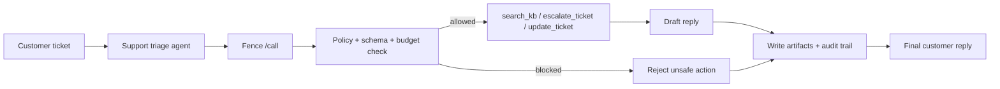

# Fence

Fence is a policy gateway for AI agent tool calls.

It sits between an agent and the tools it wants to use, and checks:

- is this tool registered?
- is this agent allowed to use it?
- are the arguments valid?
- is this action high-risk?
- should human approval be required?

Fence is built for teams that want agent actions to be controlled, auditable, and easier to integrate.

[](https://github.com/yourusername/fence/actions)
[](https://codecov.io/gh/yourusername/fence)
[](https://www.python.org/downloads/)
[](LICENSE)

## What It Includes

- FastAPI service for runtime decisions
- tool registry and policy enforcement
- Pydantic schema validation
- SQLite persistence for sessions and audit logs
- tiny Python client for integration
- support triage demo agent
- architecture diagrams and runbook

## Current Status

Fence is a real working prototype, not a finished enterprise platform.

It is useful for:

- learning how agent governance works
- integrating a policy layer into another project
- demonstrating safety checks, validation, and audit logging

It is not yet a full production control plane with multi-tenant auth, Redis, Postgres, sandboxed execution, and policy rollout.

## How Teams Use Fence

Fence is not something most teams run as a chatbot. They wire it into the path an agent takes before it touches a real tool.

Typical flow:

1. A model proposes a tool call.
2. The app sends that call to Fence.
3. Fence checks policy, schema, budget, and risk.
4. Fence returns allow or block.
5. The app executes the tool only if Fence approves it.

In practice, teams use Fence as policy-as-code for agent actions:

- update the YAML policy file to control which tools each agent can use
- mark risky tools as approval-required
- keep audit logs for every decision
- integrate Fence through the tiny client or the HTTP API

Example policy shape:

```yaml
policies:
  support-agent:
    allowed_tools:
      - search_kb
      - draft_reply
      - escalate_ticket
      - update_ticket
    blocked_operations:
      - execute_shell
    rate_limits:
      calls_per_minute: 60

tool_registry:
  execute_shell:
    risk_level: critical
    approval_required: true
```

That is the real product pitch:

Fence gives teams a small, inspectable control layer around agent actions so they can ship agents without giving them unrestricted power.

## Quick Start

### 1. Install

Fence targets Python 3.11.

```bash
python3.11 -m venv .venv
source .venv/bin/activate
python -m pip install --upgrade pip setuptools wheel
pip install -r requirements.txt
```

### 2. Start Fence

```bash
export FENCE_API_KEYS="dev-key"
export ENABLE_TELEMETRY=false
python proxy.py
```

Fence will be available at `http://127.0.0.1:8000`.

### 3. Try The Support Agent Demo

In another terminal:

```bash
source .venv/bin/activate
ollama serve
ollama pull llama3.2:1b
export OLLAMA_MODEL=llama3.2:1b
python examples/support_triage_agent.py
```

## Demo

Fence’s best demo is the support triage agent.

It shows:

- a real ticket being triaged
- the model choosing the next action
- Fence approving safe actions and blocking risky ones
- a customer reply being drafted
- audit trails and artifacts being written



Fastest local run:

```bash
ollama pull llama3.2:1b
export OLLAMA_MODEL=llama3.2:1b
python examples/support_triage_agent.py
```

## Integrate Fence

The easiest integration pattern is:

```python
from fence_client import FenceClient

fence = FenceClient(base_url="http://127.0.0.1:8000", api_key="dev-key")
decision = fence.decide_tool_call(
    agent_id="support-agent",
    tool_name="update_ticket",
    arguments={
        "ticket_id": "TK-1042",
        "fields": {"priority": "urgent"},
    },
)

if decision.success:
    # run the real tool
    pass
```

If your framework already emits provider-shaped payloads, Fence can normalize those too.

## Demos

- [Support triage agent](examples/support_triage_agent.py)
- [Integration example](examples/integration_example.py)
- [AutoGen + Ollama demo](examples/autogen_ollama_fence_demo.py)

## API Endpoints

- `GET /`
- `GET /health`
- `GET /stats`
- `GET /tools`
- `GET /tools/{tool_name}`
- `GET /policy/{agent_id}`
- `GET /schema/{tool_name}`
- `GET /sessions`
- `GET /sessions/{session_id}`
- `GET /sessions/{session_id}/audit`
- `POST /call`
- `POST /v1/decide`

## Why Fence Exists

LLMs are good at proposing actions.
They are much less trustworthy when those actions touch the real world.

Fence helps by enforcing runtime governance around tool use:

- policy
- validation
- budgets
- auditability
- human approval for risky actions

## Tech Stack

- Python
- FastAPI
- Pydantic
- SQLite
- YAML
- OpenTelemetry
- Ollama for local demo agents

## Repository Layout

```text
proxy.py                  # API server
fence_client.py           # tiny client for integration
safety_guardrails.py      # policy engine
semantic_validator.py     # schema validation
storage.py                # SQLite persistence
adapters.py               # request normalization
budgeting.py              # budget tracking
examples/                 # demos and sample data
config/                   # policy and env examples
```

## License

MIT
